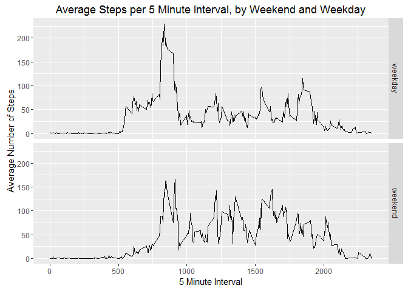

# Reproducible Research: Peer Assessment 1

## Loading and preprocessing the data
1. Read the data into R  
I read the data into R using the read.csv function  

```r
activity <- read.csv("activity.csv")
```

2. Process/transform the data into a more suitable format  
I converted the date variable from a factor to a date using the lubridate package.  

```r
library(lubridate)
activity$date <- ymd(activity$date)
```

## What is mean total number of steps taken per day?

For this question I'll ignore missing data.  

1. Make a histogram of of the total number of steps taken per day.  
I took the total number of steps per day using the dplyr package. Then I created a histogram of the resulting totals per day using ggplot2.

```r
suppressMessages(library(dplyr))
library(ggplot2)
dailytotal <- summarize(group_by(activity, date), total.steps = sum(steps, na.rm = TRUE))
ggplot(dailytotal, aes(x = total.steps)) + geom_histogram(bins=20) + ggtitle("Total Steps per day") + labs(x="Number of Steps", y="Count")
```


2. Calculate the mean and median of total number of steps taken per day.  

```r
dailymean <- mean(dailytotal$total.steps)
dailymedian <- median(dailytotal$total.steps)
dailymean
```

```
## [1] 9354.23
```

```r
dailymedian
```

```
## [1] 10395
```

As you can see above, the mean number of steps per day is 9354.23 and the median is 10395

## What is the average daily activity pattern?
for this question I'll ignore missing values

1. A time series plot of average number of steps per 5 minute interval
I made this plot by summarzing the data with the dplyr package, then plotted it using ggplot2

```r
intmean <- summarize(group_by(activity, interval), interval.mean = mean(steps, na.rm = TRUE))
ggplot(intmean, aes(x=interval, y=interval.mean)) +  geom_line() + ggtitle("Average Steps per 5 Minute Interval") + labs(x="5 Minute Interval", y="Average Number of Steps")
```


2. The interval with the highest average number of steps

```r
highavg <- max(intmean$interval.mean)
maxavgints <- subset(intmean, interval.mean == highavg)
highint <- maxavgints$interval
maxavgints
```

```
## Source: local data frame [1 x 2]
## 
##   interval interval.mean
##      (int)         (dbl)
## 1      835      206.1698
```

As you can see listed above the interval with the highest average number of steps is 835 with an average number of steps of 206.17

## Imputing missing values
For this step I will handle all missing values in the data.

1. Calculate and report the total number of missing values in the dataset
I counted the number of rows in the data with missing values.

```r
incompletes <- sum(!complete.cases(activity))
incompletes
```

```
## [1] 2304
```
There are a total 2304 incomplete rows.

2. To fill in the missing data, I'll replace missing values with the average number of steps for that interval.
3. Create a new dataset that is equal to the original dataset but with the missing data filled in.

```r
activity_full <- activity
nas <- is.na(activity_full$steps)
avg_interval <- tapply(activity_full$steps, activity_full$interval, mean, na.rm=TRUE, simplify=TRUE)
activity_full$steps[nas] <- avg_interval[as.character(activity_full$interval[nas])]
```

4. Make a histogram of the total number of steps taken each day and Calculate and report the mean and median total number of steps taken per day.
To do this I'll repeat the steps above with the filled in data set.
I took the total number of steps per day using the dplyr package. Then I created a histogram of the resulting totals per day using ggplot2.

```r
dailytotalfull <- summarize(group_by(activity_full, date), total.steps = sum(steps, na.rm = TRUE))
ggplot(dailytotalfull, aes(x = total.steps)) + geom_histogram(bins=20) + ggtitle("Total Steps per Day, Missing Data Filled In") + labs(x="Number of Steps", y="Count")
```


Calculate the mean and median of total number of steps taken per day.  

```r
options(scipen = 10)
dailymeanfull <- mean(dailytotalfull$total.steps)
dailymedianfull <- median(dailytotalfull$total.steps)
dailymeanfull
```

```
## [1] 10766.19
```

```r
dailymedianfull
```

```
## [1] 10766.19
```

As you can see above, the mean number of steps per day is 10766.19 and the median is 10766.19

the result of filling in missing data is that now the mean and median of the total number of steps per day is the same, and it is significantly higher than before.

## Are there differences in activity patterns between weekdays and weekends?

1. Create a new factor variable in the dataset with two levels -- "weekday" and "weekend" indicating whether a given date is a weekday or weekend day.

```r
activity_full <- mutate(activity_full, weektype = ifelse(weekdays(activity_full$date) == "Saturday" | weekdays(activity_full$date) == "Sunday", "weekend", "weekday"))
activity_full$weektype <- as.factor(activity_full$weektype)
```

2. Make a panel plot comparing the average number of steps for each interval on weekends vs. weekdays.  
I made this plot using dplyr to summarize and ggplot2 to plot it.

```r
fullintavg <- summarize(group_by(activity_full, interval, weektype), steps.avg = mean(steps))
ggplot(fullintavg, aes(x=interval, y=steps.avg)) + facet_grid(weektype ~ .) + geom_line() + ggtitle("Average Steps per 5 Minute Interval, by Weekend and Weekday") + labs(x="5 Minute Interval", y="Average Number of Steps")
```




